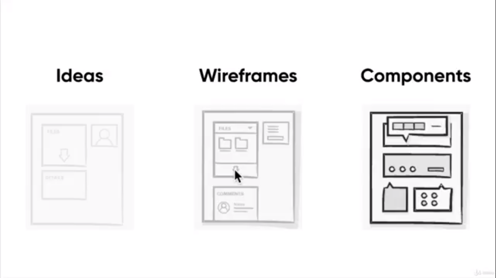

# Figma go br br
## Sketching
1. An intro to sketching
Là một quá trình gồm 2 bước:
- Khởi tạo ý tưởng: phác họa ra nhiều ý tưởng về sản phẩm nhất có thể
- Thêm các chi tiết vào ý tưởng: thêm các chi tiết rõ hơn vào từng ý tưởng, có thể bỏ các ý tưởng không phù hợp

2. From idea generation to refinement
