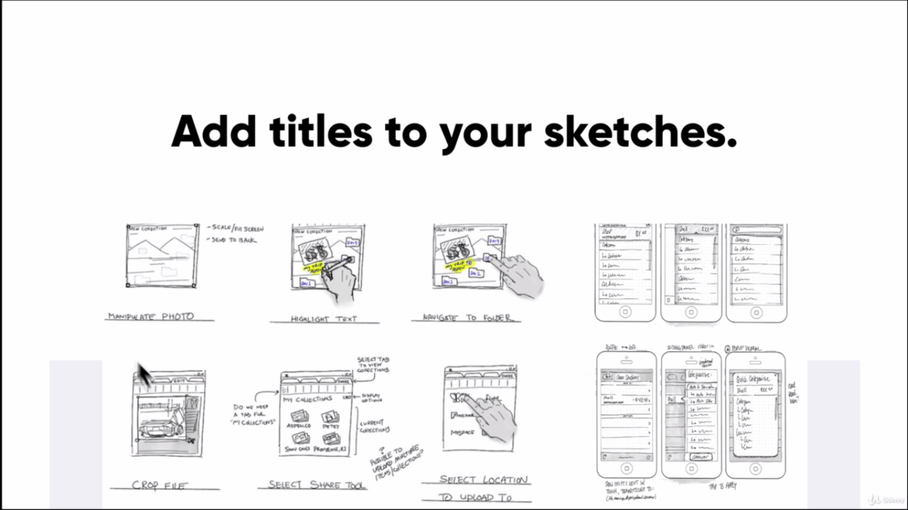
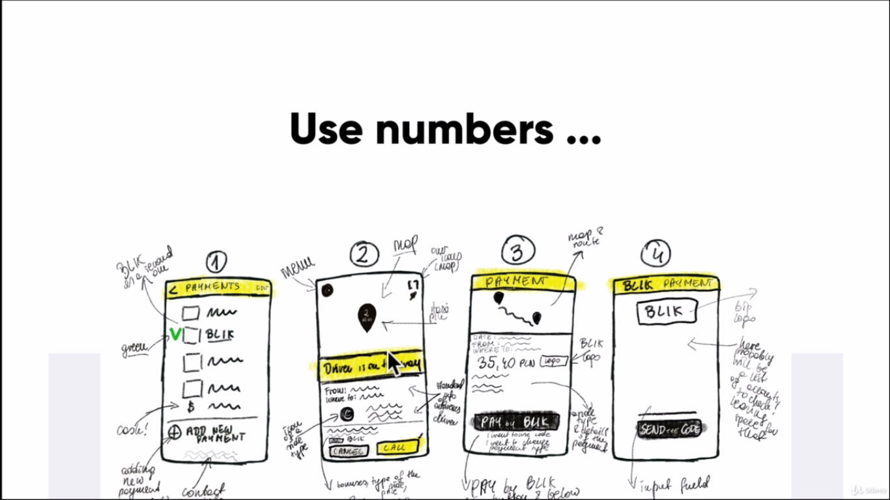
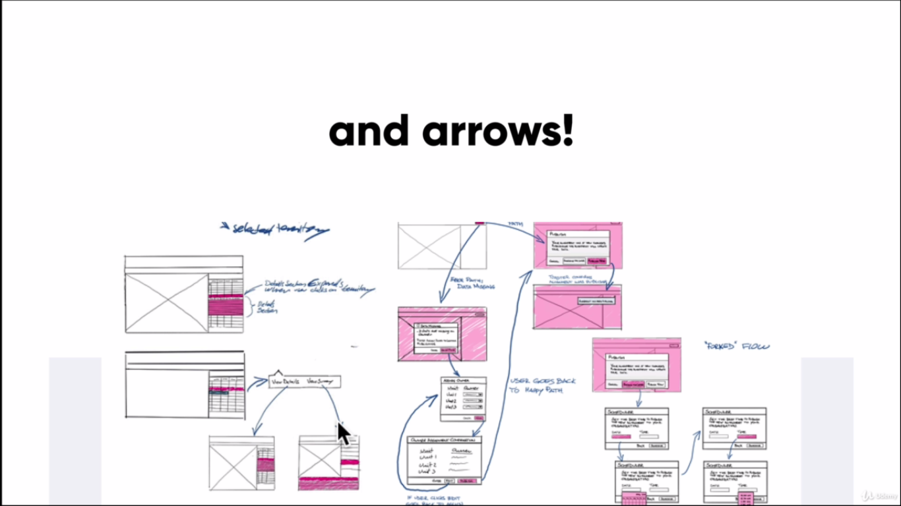
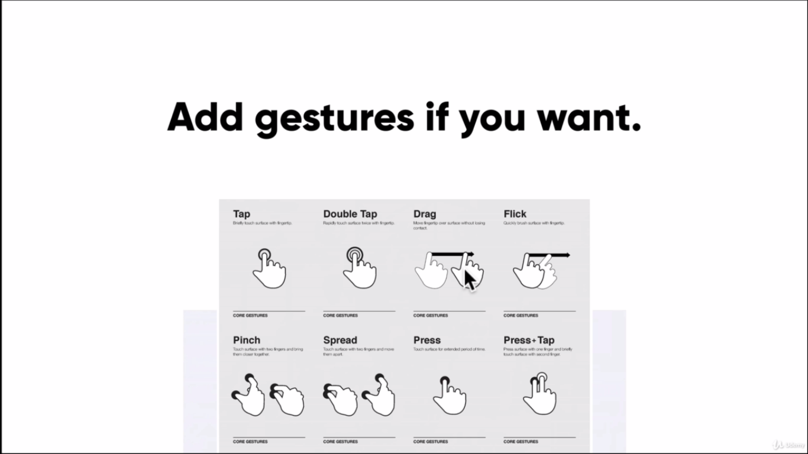
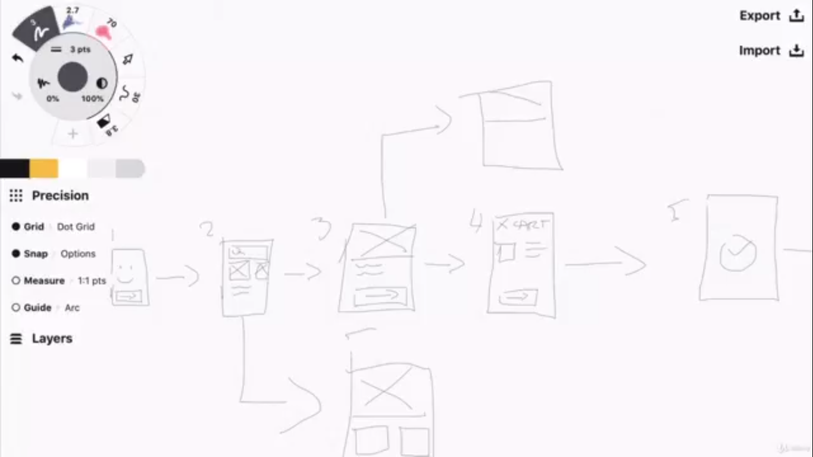
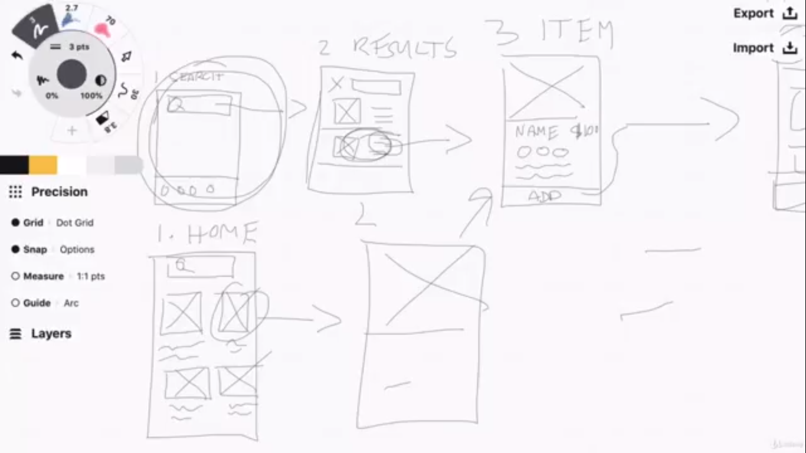
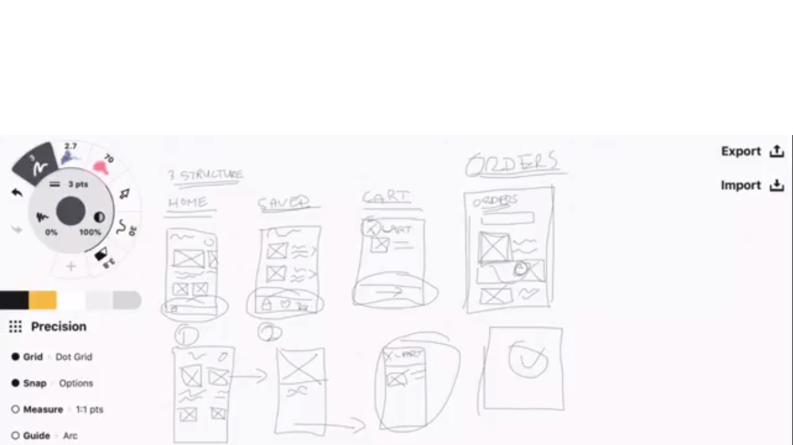
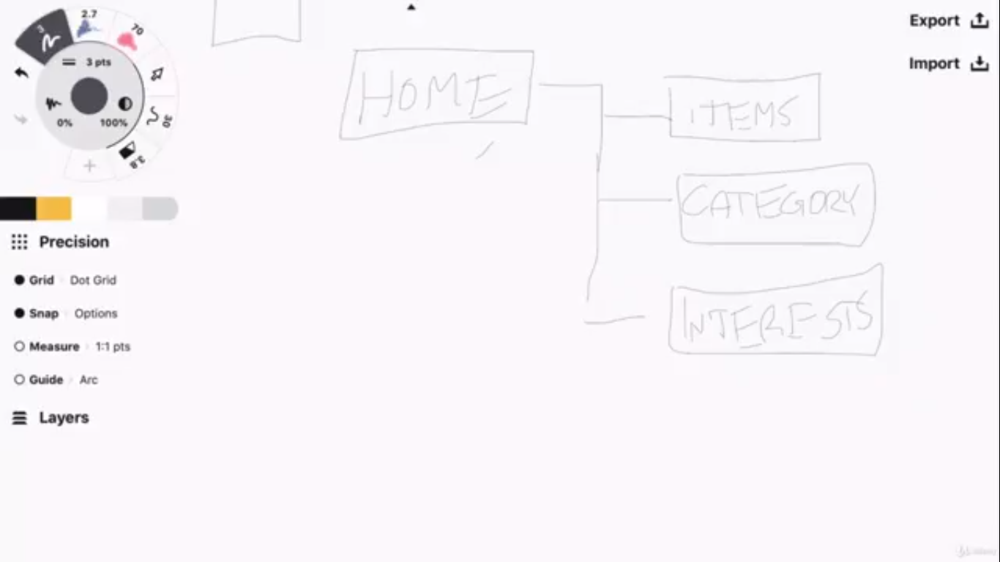
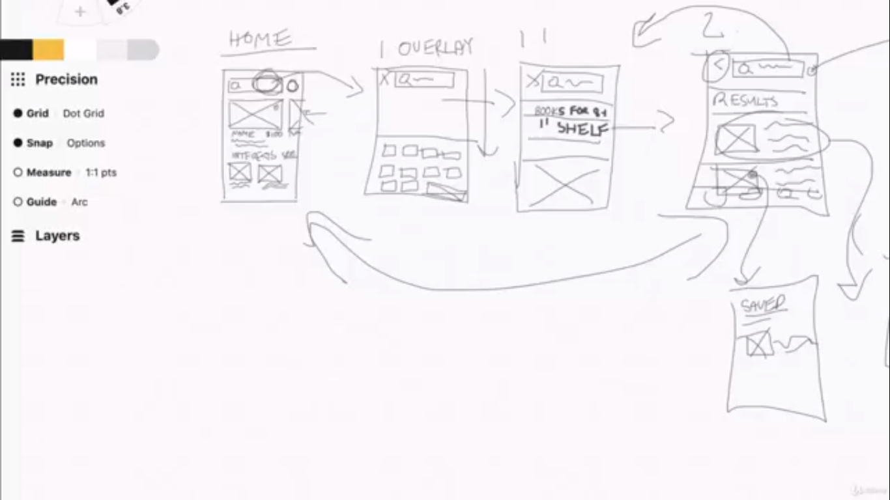

# Figma go br br

## Skills to be a top designer
1. Graphic Design
- Color
- Color theory
- Layout
- Typography
- Sketching
- Font
- Image
- **=> All about visual things 😆**

2. User Experience
- Provide user with the best posible experience
- Understanding customer

3. Goal Conversion

4. Platform Development

## Resource online
- [Zero to mastery](https://zerotomastery.io/resources/)
- [GoodUI.org](https://goodui.org/): Greate for goal conversion
- [Awwwards](https://www.awwwards.com/): Inspiration
- [Behance](https://www.behance.net/): Inspiration
- [Flat icon](http://flaticon.com/)
- [Image](https://unsplash.com/)

## Sketching

1. **An intro to sketching**
Là một quá trình gồm 2 bước:
- Khởi tạo ý tưởng: phác họa ra nhiều ý tưởng về sản phẩm nhất có thể
- Thêm các chi tiết vào ý tưởng: thêm các chi tiết rõ hơn vào từng ý tưởng, có thể bỏ các ý tưởng không phù hợp

2. **From idea generation to refinement**

3. The sketching process
- Step 1: Be prepared!
  - Chuẩn bị sẵn công cụ 
  - Lên mục tiêu cần đạt được
  - Ai là người dùng
  - Lên kế hoạch về thời gian

- Step 2: Ready, Set,... Go!
  - Draw a frame for your device
  - Start with more simple and redundant elements...
  - And then move onto some more detailed interactions
  - Annotate your sketches and keep them safe
  - Keep going
  - Share your sketches

- Step 3: Refinement
  - Add title for your sketches
    
  - Add annotations
    
  - Use numbers
    
  - Add arrow (transition)
    
  - Add gestsures if you want
    
    
4. Sketching user flows
   
   Phác thảo workflow của người dùng, từ khi vào app cho đến khi mua hàng thành công, suy nghĩ về những trường hợp tìm kiếm thành công và tìm kiếm không thành công. Suy nghĩ về đối tượng người dùng là ai, họ có vui khi thực hiện flow này không?
   
   
   
   Screen flow, khi bấm vào 1 nút thì sẽ làm gì, suy nghĩ về các ngữ cảnh sử dụng, sử dụng như nào thì tối ưu hóa thao tác của người dùng. Phác thảo cấu trúc giao diện đã hợp lý chưa.
   
   
   
   Sketching thanh điều hướng, phác thảo giao diện các màn hình cùng với các thao tác tương ứng ở thanh điều hướng.
   
   
   
   Phác thảo sitemap, theo các thành phần bên trong 1 màn hình theo dang cấu trúc cây
   
   
   
   Phác thảo trạng thái giao diện (sketching screen state). Phác thảo trạng thái khi người dùng bấm vào khung tìm kiếm, 1 overlay hiện ra. Bố cục chi tiết của từng sản phẩm, rồi khung filter,...
   
   

5. Inspiration
- How do I stay inspired?
  
  You need to constantly simulate your creativity
  
  - Talk to your peers
  
  - Study others
  
  - Surround yourself with great design
  
  - Stay educated on a variety of topics
  
  - Design for yourself
  
  - Just take a walk