# Complete Web & Mobile Designer Zero to Mastery

Flow

- Meeting the Client
- Getting started

  - Sketching
  - Inspiration
  - User flows
  - Sitemaps

- Explore & Iterate

  - Wireframes
  - Prototyping
  - Getting feedback

- Visual Design

  - Grids + Spacing
  - Typography
  - Forms + UI Elements
  - Colors
  - Imagery + Iconography
  - Accessibility

- Design Exploration

  - Design Patterns
  - Mobile Design
  - Applying Visual Design
  - Motion
  - Micro-interactions

- Putting it together

  - Design Systems
  - Final compositions

- Web Portfolio

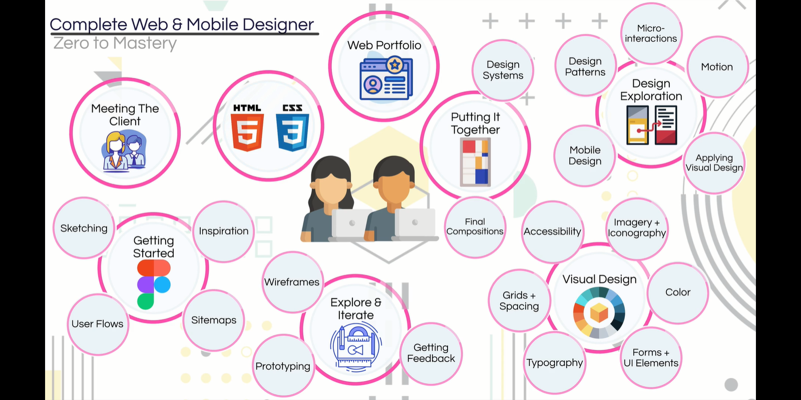

Designer vs. Developer

| Designer                     | Developer                                                     |
| ---------------------------- | ------------------------------------------------------------- |
| Focus on customer experience | Focus on the internal, the thing that makes the product works |

The phases of building any products

| Phase       | Job                                                                                                                                              | For                  |
| ----------- | ------------------------------------------------------------------------------------------------------------------------------------------------ | -------------------- |
| Planning    | The most important, design and map the entire project. Look & Feel, interacting with client & design what their goals are                        | Designer             |
| Design      | Using information in the planning phase to create something likes site structure, mobile structure, visual representation, how the product looks | Designer             |
| Development | Implement the design on the live website or on the mobile app                                                                                    | Developer            |
| Launch      | Delivery our product to user                                                                                                                     | Developer            |
| Post-Launch | Hand-off the product to the client, monitor how the user uses the product, is there any issue?                                                   | Designer & Developer |

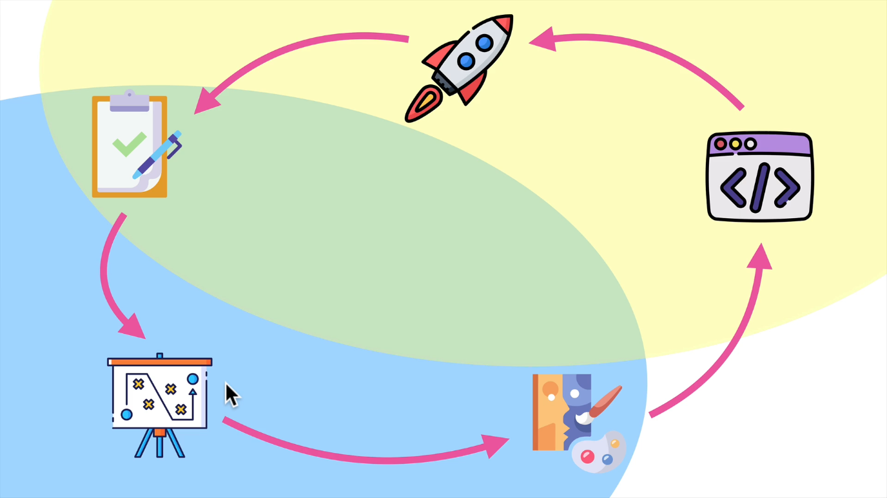

Skill to be a top designer, 4 key elements:

- Graphic design: using colors, colors theory, layout, typography, sketching, using fonts, images: **all about the visual**
- User experience (UX): study user experience & user interface design, how can you makes a user moves to your products in an ejoyable way, an easy flow? It's **all about understanding the customer**
- Goal conversion: design a product that the client wants
- Platform development: mobile or web

Some resources:

- [https://zerotomastery.io/resources/](https://zerotomastery.io/resources/)
- [https://goodui.org/](https://goodui.org/) for goal conversion
- [https://www.awwwards.com/](https://www.awwwards.com/) for inspiration
- [https://www.behance.net/](https://www.behance.net/) for inspiration, portfolio
- [https://www.flaticon.com/](https://www.flaticon.com/) for icons
- [https://unsplash.com/](https://unsplash.com/) for images

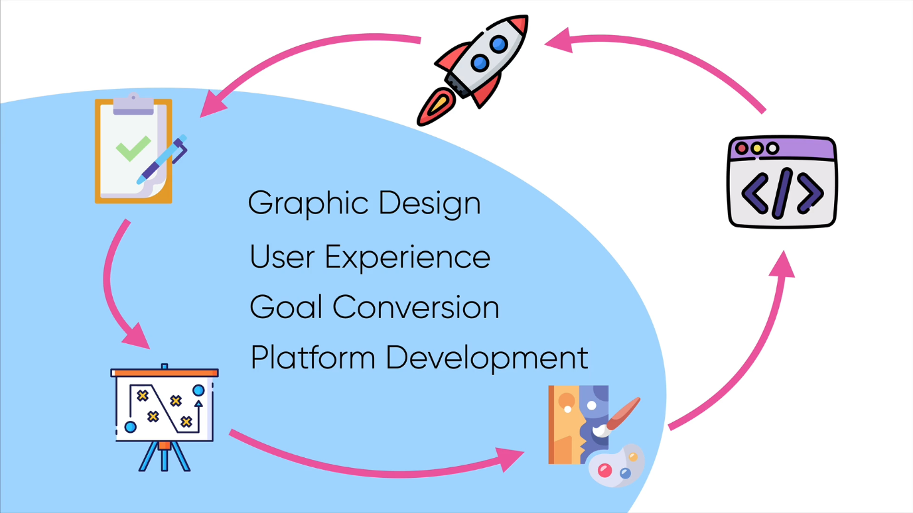

## 1. Meeting the client

- We are creating a new product
- Product designer: can design on any platform: web, mobile, ...
- Client wants to build a massive shop online that can takes on Amazon

## 2. Sketching

Used for:

- Idea generation
- Flow

### 2.1. An intro to sketching

Sketching is a two step process:

- Idea generation: generate as many ideas as we can > Sketch
- Add detail: it's ok to kill some ideas in here > Refine

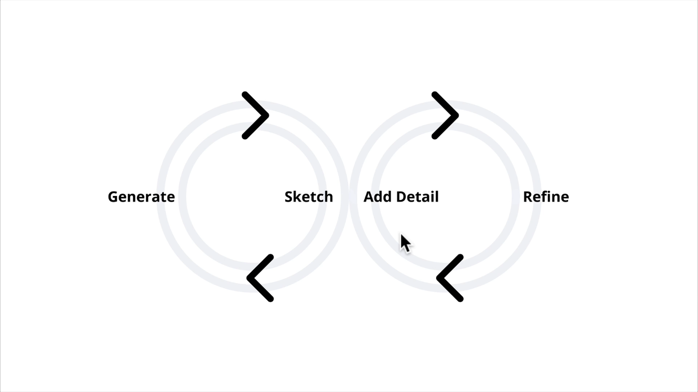

From idea generation to refinement

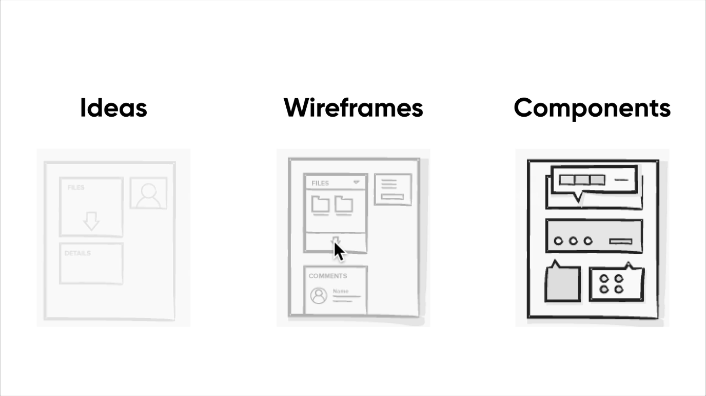

### 2.2. The sketching process

Step 1: Be prepared!

- Prepare your tools beforehand
- What are your goals?
- Who is your audience?
- Time-box yourself

Step 2: Ready, Set ... Go!

- Draw a frame for your device
- Start with more simple and redundant elements: footer, header, elements that you have seen alot
- Move onto some more detailed interactions: square, rectangle, circle, line, ...
- Annotate your sketches and keep them safe
- Keep going
- Share your sketches

Step 3: Refinement

- Add titles to your sketches

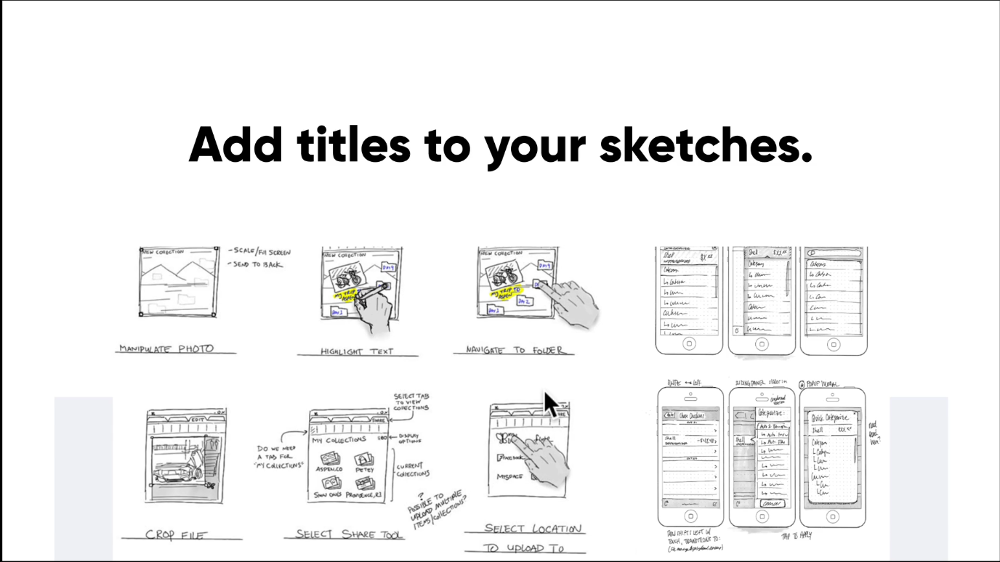

- Add annotations... again

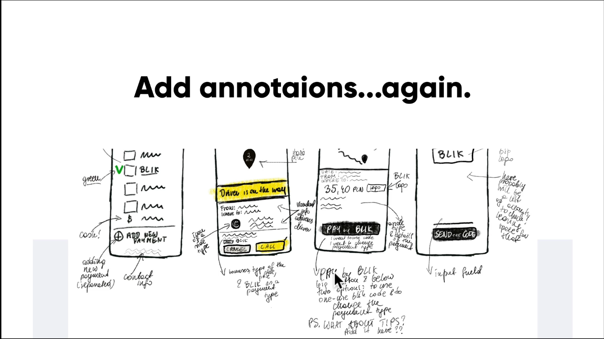

- Use numbers

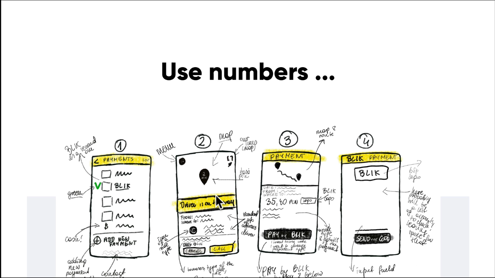

- Use arrows

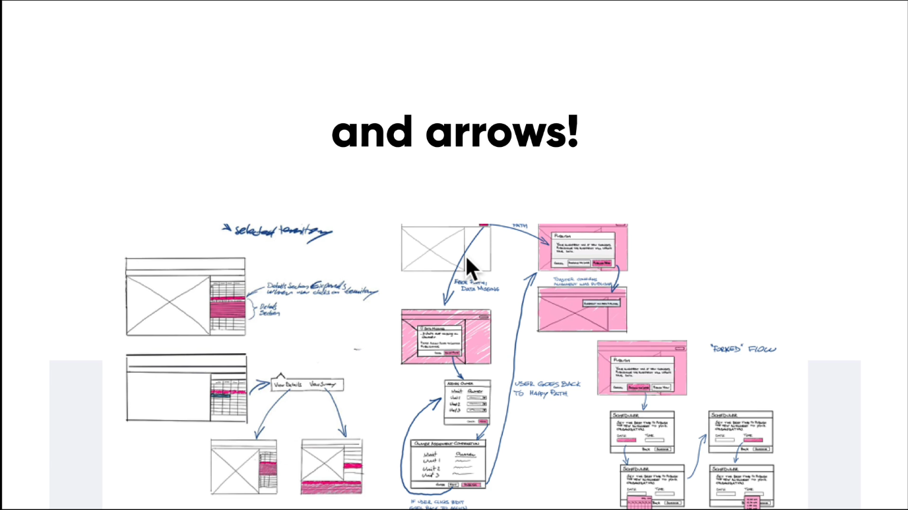

- Add gestures if you want

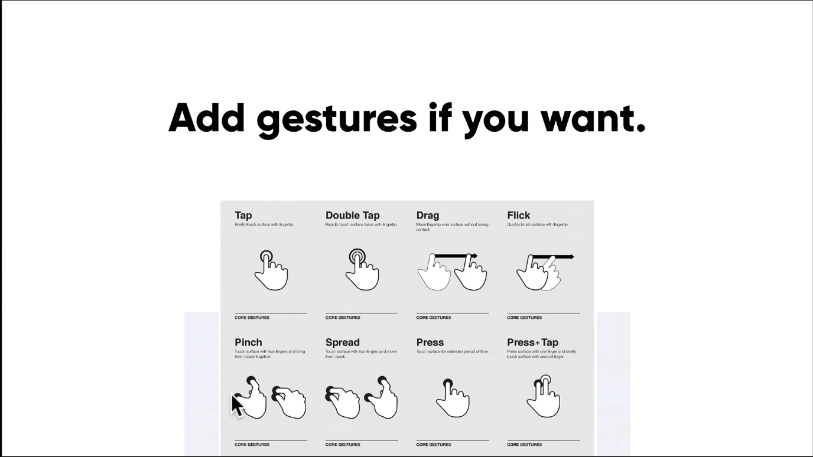

### 2.3. Sketching user flows #1 (Overrall flow)

- Think about what your want to sketch
- Define some sort of starting point: the most difficult or the quicky part first, some designers
  start at the end and then figure out the way to achieve it
- Design your next step, ask yourself some important questions

  - which ways this step lead our users?
  - where do you want them to go?
  - what are the users need to do to get there?

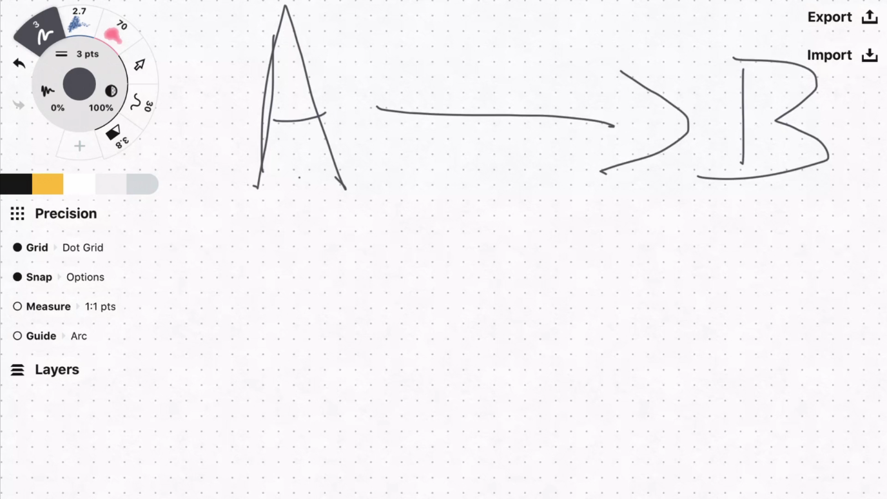

- Happy flow: user enter the app and make purcharge

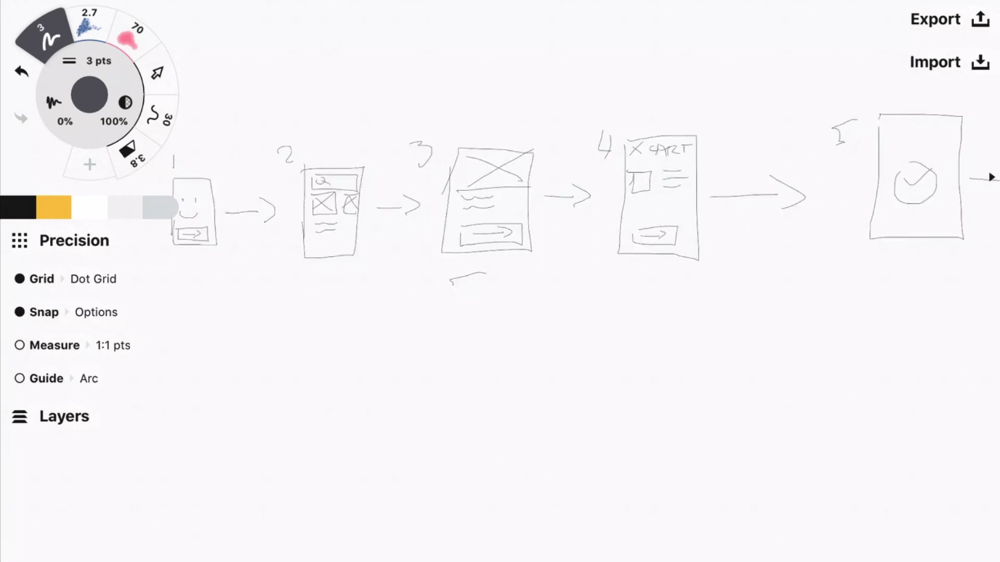

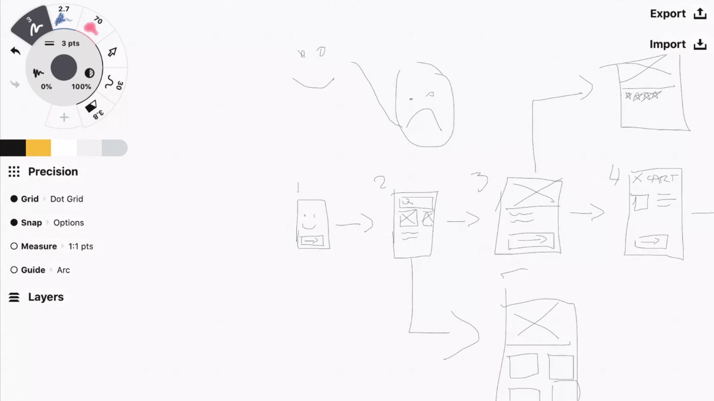

### 2.4. Sketching user flows #2 (Screen flow)

Focus on user actions through a specific flow, thinking about all the scenarios

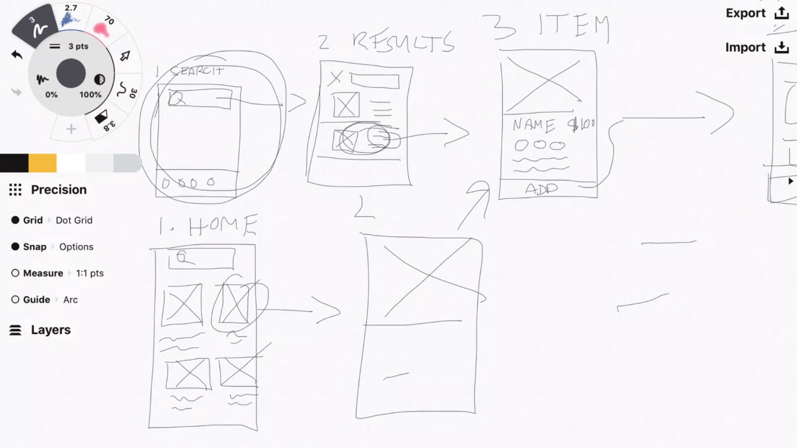

### 2.5. Sketching user flows #3 (Navigation scheme)

What options users can choose?

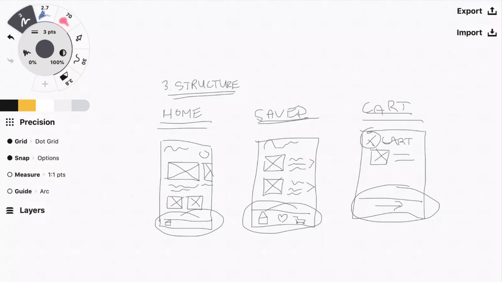

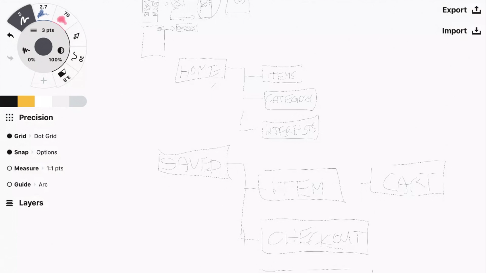

### 2.6. Sketching user flows #4 (Screen state)

Draw an entire screen on different interactions & micro interactions

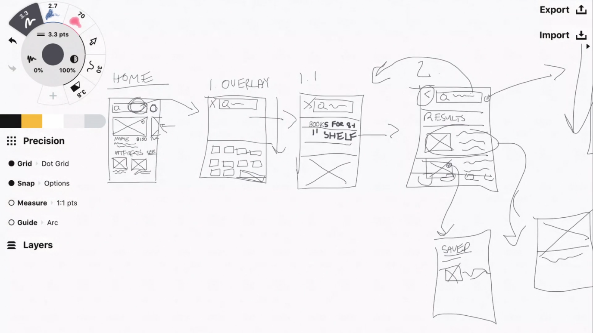

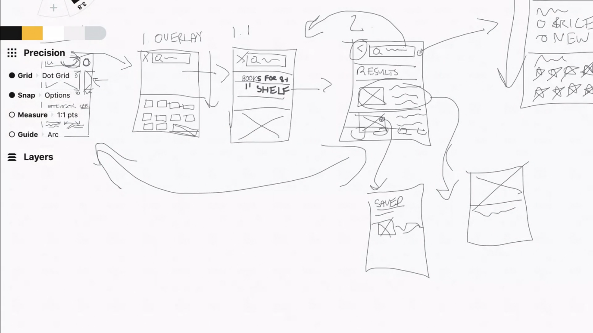

### 2.7. Sketching tips

- Don't worry about messy, thinking and sketching and then refines them
- Sketch quickly, don't worry about the details
- Use basic block: square, rectangle, circle
- Keep your sketch safe
- Always be prepared
- Communicate
